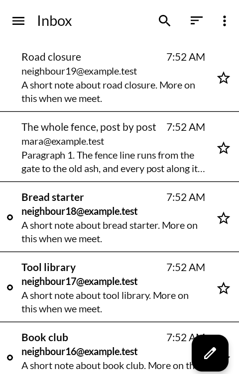
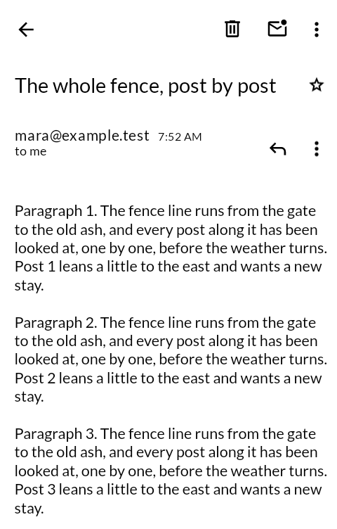
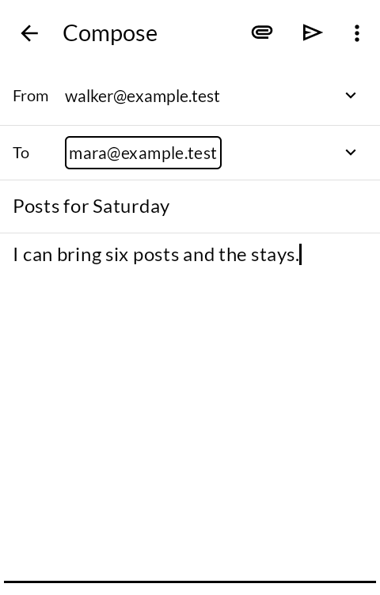
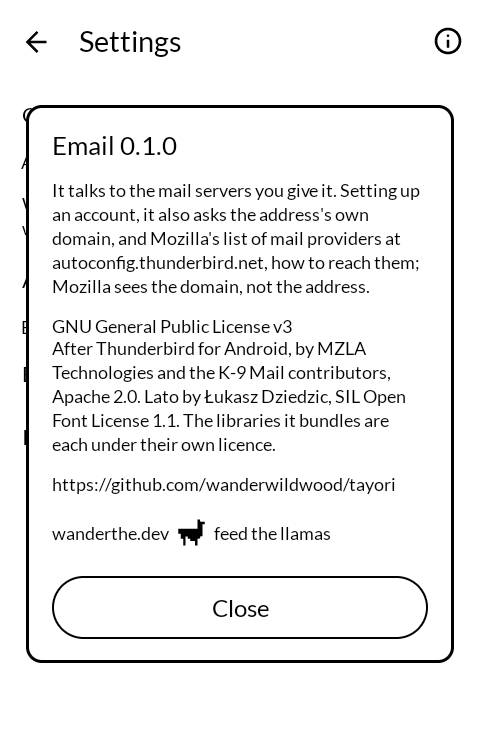

# 便り tayori — Email

Email for an E Ink phone: IMAP or POP3 in, SMTP out, in black and white, and a swipe turns
a page.

*Tayori* is 便り — word from someone: a letter, news, the thing you hope is in the box.

Built for the [Mudita Kompakt](https://mudita.com/products/kompakt/), whose 4.3" panel has
sixteen greys, a slow redraw, and is read outdoors as often as indoors.

Fork of [Thunderbird for Android](https://github.com/thunderbird/thunderbird-android),
which was K-9 Mail before it, with the mail itself left as they built it and the screen
redrawn for this one.

| | |
|---|---|
|  |  |
|  |  |

## What changed from Thunderbird

- **Black and white, in Lato**, the face Mudita's own apps use, the message body included.
- **A swipe turns one page and stops**, in the inbox, in a message and in settings. The
  row, or the line, the old page cut through opens the new one. Nothing scrolls on its own
  and nothing animates.
- **No avatars and no icons on settings rows.** The name is the thing.
- **Dialogs and menus are white inside a black rim**, and never grey out the screen behind
  them.
- **It opens on your address.** No welcome page and no Thundermail.

## Signing in

Any server that speaks IMAP or POP3 and SMTP with a password. Setting up an account, it
looks up how to reach your provider; if it cannot find out, you fill the servers in by hand.

**There is no "Sign in with Google" or Microsoft.** Those sign-ins are registered to
Mozilla's app, not to this one. Gmail, Yahoo, AOL and Fastmail take an app password
instead, made in the account's own security settings. Outlook.com no longer accepts one,
so it cannot be used here.

## What it sends where

Your mail goes between the phone and the servers you give it, and nowhere else. Setting up
an account also asks the address's own domain, and Mozilla's list of providers at
`autoconfig.thunderbird.net`, how to reach them; Mozilla is told the domain, not the
address. Pictures in a message are not fetched unless you ask. See [PRIVACY.md](PRIVACY.md).

## Getting it, and keeping it

Download <https://github.com/wanderwildwood/tayori/releases/latest/download/tayori.apk> and
sideload it. That address always points at the newest release, and every release publishes a
`.sha256` beside the APK.

For updates, add this repository to [Obtainium](https://github.com/ImranR98/Obtainium):

    https://github.com/wanderwildwood/tayori

**The application id is settled** — updates install over what you have, keeping your
accounts and mail. It installs beside Thunderbird rather than over it.

## Building

```
./gradlew :app-thunderbird:assembleFossRelease
```

JDK 21. The build is large: Gradle and Kotlin are each held to 4 GB in `gradle.properties`.

A release is signed by a keystore in `signing/`, which is not in this repository. Without
it the release APK builds **unsigned** and will not install anywhere — there is no
fallback key by design.

## Credit

Thunderbird for Android by MZLA Technologies and the Thunderbird and K-9 Mail contributors,
Apache License 2.0 — nearly all of this is theirs, and its history is kept here whole. The
libraries it bundles are each under their own licence.

The face is [Lato](https://www.latofonts.com/) by Łukasz Dziedzic, SIL Open Font License 1.1
([LICENSE-Lato-OFL.txt](LICENSE-Lato-OFL.txt)).

## Licence

**GNU General Public License, version 3.** See [LICENSE](LICENSE). Thunderbird's own code
remains under the Apache License 2.0 ([LICENSE-APACHE-2.0](LICENSE-APACHE-2.0), [NOTICE](NOTICE)),
which lets it be carried into a GPL work.

Copyright © wander wildwood for the changes, and © the Thunderbird and K-9 Mail authors for
everything else.
